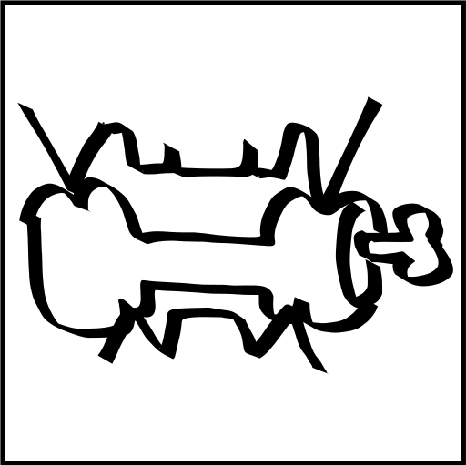

#  Carnivore
Carnivore is a simple scripting language based in [toml](https://toml.io/en/).

## Work in progress
- [x] cli interface skeleton
- [x] allocator
- [x] tokenizer
- [ ] lexer
- [ ] run function
- [ ] import functionality

## Development rules
* General:
	* keep the code clean
	* identation style is [K&R](https://en.wikipedia.org/wiki/Indentation_style#K&R_style) (Variant 1TBS)
* Carnivore function names: `carnivore_<what_it_does>` (snake_case)
* Types:
	* types are CamelCase: `typedef int Int`
	* `typedef unsigned int UnsignedInt`
	* this is an example, instead of unsigned ints please use uint32_t or size_t for sizes
* Main:
	* The main is for the carnivore behaviour as an interpreter!
	* No parser, lexer or any other carnivore internal can be defined in main!
	
